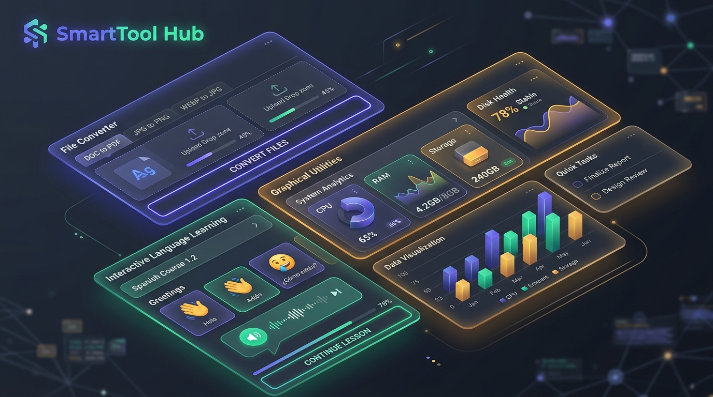

# 🛠️ SmartTool Hub - 萬能工具箱

**SmartTool Hub** 是一個專為現代使用者、開發者、語言學習者打造的一站式多功能工具箱網頁應用程式 (all-in-one productivity suite)。本專案採用 React 18、Vite、TypeScript 與 Tailwind CSS 進行全螢幕極簡卡片化視覺開發，確保在所有裝置上都能享有極致流暢、精緻優雅的互動體驗。

---

## 🌟 核心工具特色集錦

### 1. 🎥 影音媒體轉碼器 (Media Converter)
*   **高效轉碼技術**：基於 WebAssembly 的 **FFmpeg.wasm v12**，直接在瀏覽器端本地端進行 100% 隱私安全的影音格式轉換 (支援 MP4, WebM, MKV, MP3, WAV, AAC, GIF 等)。
*   **智能多執行緒檢測**：自動檢測瀏覽器 SharedArrayBuffer 支援狀態。於安全沙盒限制下，能自動平滑降級為「單執行緒相容模式」，保證 100% 成功編譯，並引導使用者於獨立頁面解鎖「多執行緒高速處理」的核心效能。
*   **自訂多媒體規格**：自由調整影音畫質（高、中、低）、影片解析度 (Resolution)、每秒幀數 (FPS) 及音訊位元率 (Bitrate)，更支援靜音 (Mute) 選項。

### 2. 🇯🇵 語言工具中心 (Language Hub)
本工具包含三大核心模組，致力於打造符合現代設計美學、護眼、高品質的語音學習環境：
*   **日語五十音圖表 (50Kanas Grid)**：平假名、片假名對照，且全面配置 Text-to-Speech (TTS) 本地原音朗讀發音與羅馬拼音對照。
*   **文法精煉工具 (Grammar Tool)**：精選日常與專業必備之語序、助詞、語音範例，卡片採用溫柔高對比非反光色階設計，提供長時間閱讀的舒適度。
*   **單字熟練卡 (Vocabulary Tool)**：拼讀、翻譯與記憶閃卡，支援發音撥放與一鍵即時朗讀複習。

### 3. 📹 螢幕錄製與製片 (Screen Recorder)
*   可在免裝擴充套件下錄製整個螢幕、特定應用程式視窗或瀏覽器分頁。
*   提供麥克風人聲與系統音訊混音控制，完美契合線上教學、簡報與開發示範需求。

### 4. 🔑 開發者安全密碼產生器 (Password Generator)
*   高強度亂數生成，可自訂長度、大寫字母、小寫字母、數字與特殊符號。
*   密碼強度（Strength Indicating Ring）環形圖形顯示，一鍵貼心快速複製。

### 5. 🟦 向量行動條碼產生器 (QR Code Generator)
*   支援文字、聯絡資訊與網址的快速 QR Code 特效渲染。
*   一鍵即時輸出高清晰 PNG/SVG，方便數位推廣。

### 6. ⏱️ 專注力工具 (Timer & Clock Tools)
*   **精確倒計時 (Timer)** 與實用秒錶，界面配備精美且動態微調的環形外框與物理微秒動畫。

### 7. 📏 萬用科學單位換算 (Unit Converter)
*   支援長度、重量、溫度、面積、儲存容量 (Byte, KB, MB, GB, TB) 的一鍵交互式即時換算。

---

## 🎨 視覺與互動工藝規範

*   **柔和深色模式 (Mitigated Dark Palette)**：專為經常長時間在夜間或暗處工作的開發者、學習者進行色彩優化。我們調降了原始暗色階（如純黑 `#000000`）的強烈對比，改用深灰藍 `slate-900/40` 與極細緻之微光邊框 `slate-800/50`，讓整體操作界面既具有現代感又能保障眼睛長時間注視的舒適感。
*   **極低干擾介面**：嚴禁任何未經允許的背景遙測日誌（No Tech-Larping / Anti-AI-Slop），讓操作視覺保持純淨。
*   **微動效體驗**：基於 Framer Motion 的物理阻尼感微交互（Micro-interactions），每一次 Hover 與 Click 均伴隨合理的縮放及色彩飽和回饋。